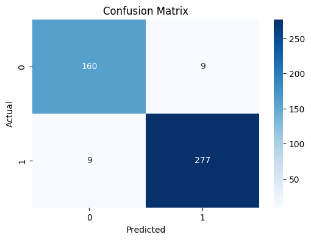
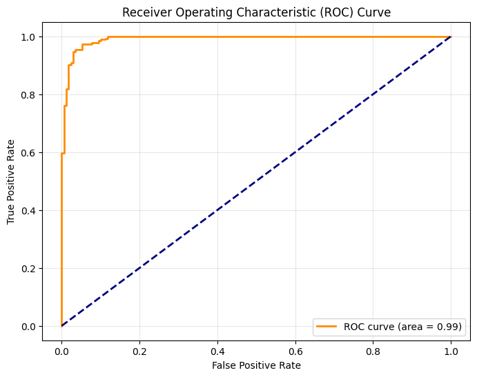
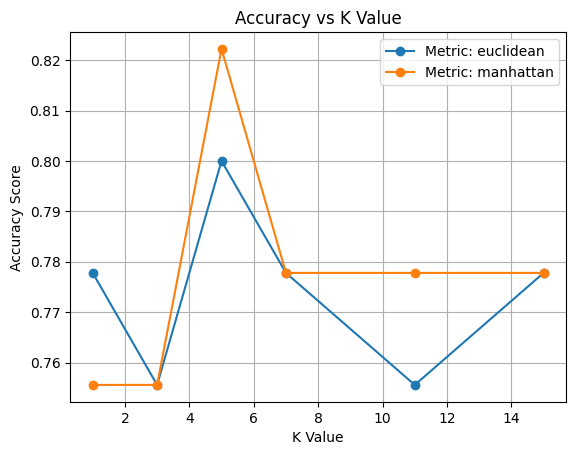
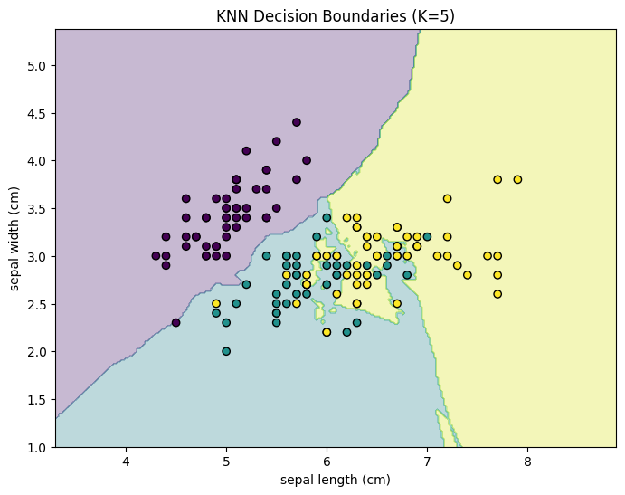
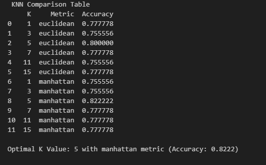
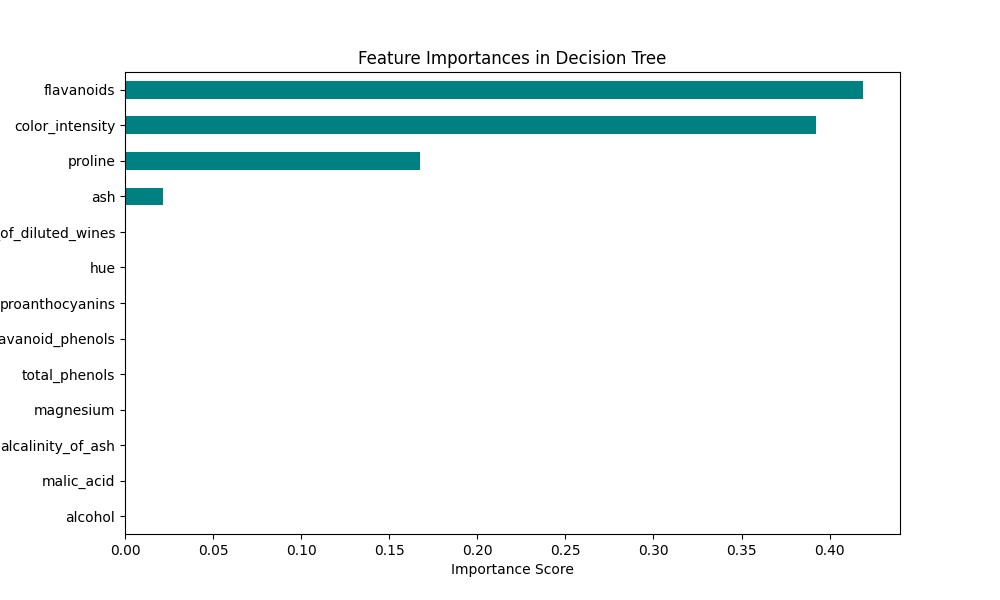

# ML_WEEK4_B01
# 🚀 ML-Internship

> **Name:** Muhammad Fahad  
> **Email:**   
> **LinkedIn:**   
> **Start Date:** 20-12-2025  

---

[]

---

## 📌 Project Overview
This repository documents my **Week 4 Machine Learning Internship tasks**, focused on **classification algorithms**.  
It includes **Logistic Regression, KNN, Decision Tree, and Multi-class Classification**, with model evaluation, visualizations, and model saving.

---

## 📈 Week 4 Tasks Overview

| Task | Title | Dataset | Status |
| :--- | :--- | :--- | :--- |
| 4.1 | Logistic Regression | Breast Cancer Wisconsin | ✅ Completed |
| 4.2 | KNN Classification | Iris | ✅ Completed |
| 4.3 | Decision Tree Classifier | Iris (or Wine Quality) | ✅ Completed |
| 4.4 | Multi-class Classification | Digits | ✅ Completed |

---

## ✅ Task Details

### **Task 4.1: Logistic Regression (Binary Classification)**

- **Dataset:** Breast Cancer Wisconsin (`sklearn.datasets.load_breast_cancer`)  
- **Steps Implemented:**  
  - Data exploration with `df.head()` and `df.info()`  
  - Check class distribution  
  - Train-test split and feature scaling (`StandardScaler`)  
  - Train `LogisticRegression`  
  - Predictions and metrics: **Accuracy, Precision, Recall, F1-score, ROC-AUC**  
  - Plotted **Confusion Matrix** using Seaborn and **ROC Curve**  
  - Saved model as `.pkl`  

**Files:** `logistic_regression.py`, `logistic_regression.pkl`  

**Visuals:**  

Confusion Matrix  
  

ROC Curve  
  

---

### **Task 4.2: K-Nearest Neighbors (KNN) Classification**

- **Dataset:** Iris (`sklearn.datasets.load_iris`)  
- **Steps Implemented:**  
  - Selected 2 features for visualization  
  - Tested K = 1,3,5,7,11,15 with **Euclidean** and **Manhattan** metrics  
  - Calculated accuracy for each K and plotted **Accuracy vs K**  
  - Visualized **decision boundary** for K=5  
  - Generated comparison table and identified optimal K  

**Files:** `knn_classification.py`  

**Visuals:**  

Accuracy vs K  
  

Decision Boundary (K=5)  
  

Comparison Table  
  

---

### **Task 4.3: Decision Tree Classifier**

- **Dataset:** Iris (or Wine Quality)  
- **Steps Implemented:**  
  - Trained Decision Tree with `max_depth = 3,5,10,None`  
  - Compared accuracy to find optimal depth  
  - Visualized **Tree Structure** (`plot_tree`)  
  - Extracted **feature importances** and plotted bar chart  
  - Saved **best model** as `.pkl` and exported tree as image  

**Files:** `decision_tree.py`, `best_decision_tree.pkl`, `decision_tree.png`  

**Visuals:**  

Decision Tree  
  

Feature Importance  
  

---

### **Task 4.4: Multi-class Classification & Evaluation Metrics**

- **Dataset:** Digits (`sklearn.datasets.load_digits`)  
- **Steps Implemented:**  
  - Train-test split and feature scaling  
  - Trained **Logistic Regression (OVR)**, **KNN**, and **Decision Tree**  
  - Evaluated with **classification_report**, **confusion matrix**, and **accuracy**  
  - Plotted side-by-side **confusion matrices**  
  - Created **accuracy comparison bar chart**  

**Files:** `multiclass_classification.py`  

**Visuals:**  

Confusion Matrices  
  

Accuracy Comparison  
  

---

## 🧠 ML Projects

- Logistic Regression (Binary)  
- KNN Classification (Optimal K)  
- Decision Tree (Pruned, Feature Importance)  
- Multi-class Classification (Digits Dataset)  

---

## 💻 Tech Stack
* **Languages:** Python, Markdown  
* **Libraries:** NumPy, Pandas, Matplotlib, Seaborn, Scikit-Learn  
* **Tools:** Git, VS Code, Pickle, 

---

## 📜 License
This project is licensed under the MIT License.
